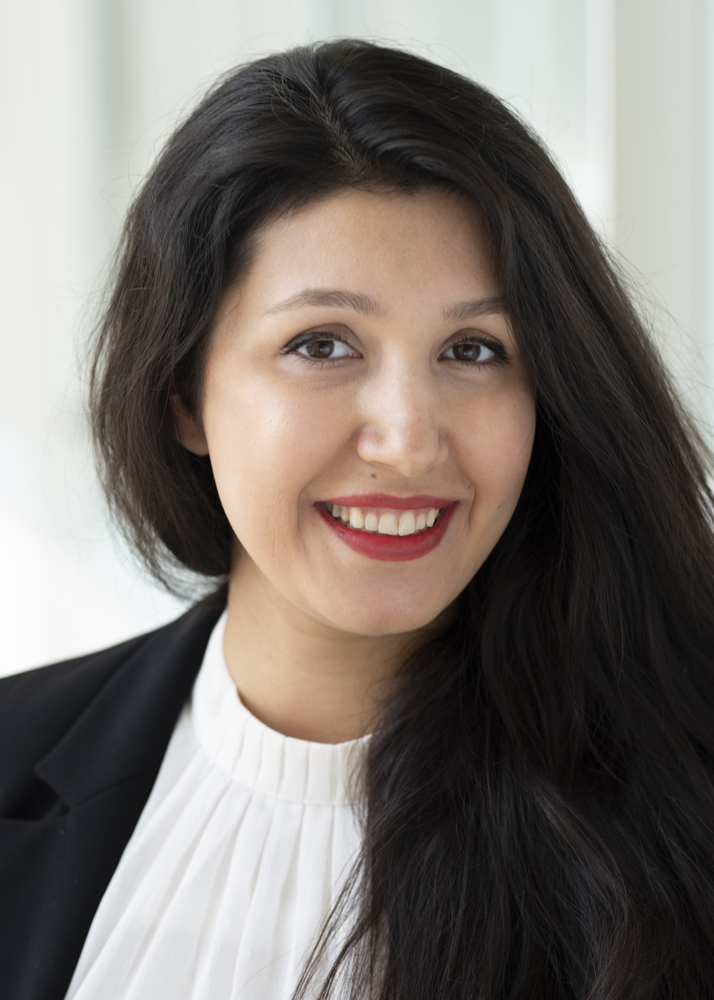

| [Home](index.md) | [Publications](https://scholar.google.com/citations?user=4Vjp6hwAAAAJ&hl=en) | [Talks](talks.md) | [Interviews & Media](news.md) | [Awards](awards.md) | [Teaching](teaching.md) | [EQUAL Lab](student.md) | 

## Assistant Professor at McGill University/University of Montréal/MILA

    

Dr. Golnoosh Farnadi is an Assistant Professor of the School of Computer Science at McGill University, and Adjunct professor at University Montréal. She is a core faculty member at MILA (Quebec Institute for Learning Algorithms) and hold Canada CIFAR AI chair. She is the Director of the [EQUAL lab](student.md) at McGill University. EQUAL lab (**EQ**uity & **EQ**uality **U**sing **A**I and **L**earning algorithms) is a cutting-edge research laboratory dedicated to advancing the fields of algorithmic fairness and responsible AI. With a mission to promote equity and equality in AI systems, Equal Lab harnesses the power of advanced learning algorithms and AI technologies to tackle the pressing issues surrounding bias and discrimination in AI and machine learning models.

Prior to this, Golnoosh hold a similar position at HEC Montréal (U. Montreal's business school) and from 2018-2020, she was a a post-doctoral IVADO fellow at University of Montreal and MILA working on fairness-aware sequential decision making under uncertainty with [professor Simon Lacoste-Julien](http://www.iro.umontreal.ca/~slacoste/) and [professor Michel Gendreau](https://www.polymtl.ca/expertises/en/gendreau-michel). From 2017-2018, she was a postdoc researcher of the Statistical Relational Learning Group (LINQS) of [professor Lise Getoor](https://getoor.soe.ucsc.edu/home) at the University of California, Santa Cruz. 

Golnoosh obtained her Ph.D. in Computer science from KU Leuven and Ghent University in 2017 with a dissertation on user modeling in social media under the supervision of [professor Martine de Cock](http://faculty.washington.edu/mdecock/) and [professor Marie-Francine Moens](https://people.cs.kuleuven.be/~sien.moens/). During her PhD, she was a visiting scholar at UCLA, University of Washington, Tacoma, Tsinguha University, and Microsoft research, Redmond. 

In 2021, she won Google Scholar Award and Facebook Research Award and was named one of the Rising Stars, a list of 20 promising new diverse talents in AI Ethics.

### Research Interest

- Algorithmic Fairness
- Privacy-preserving Machine Learning
- Responsible AI 
- Optimization
- Deep Learning and Generative AI

## Contact

Email: [farnadig@mila.quebec](farnadig@mila.quebec)

